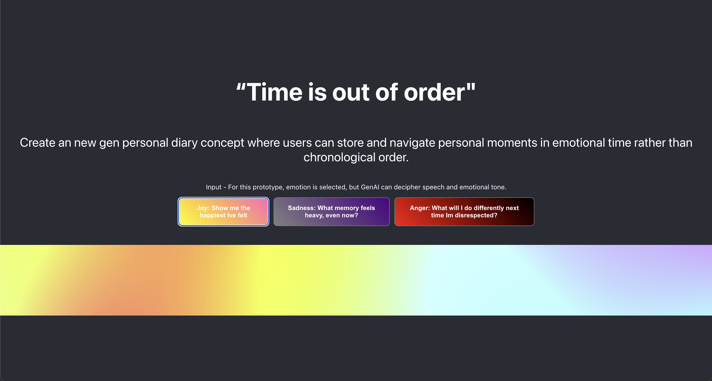

# Salvador Munoz Castillo Application Assignment 

**Concept:** Create an new gen personal diary concept where users can store and navigate personal moments in emotional time rather than chronological order. 



## Run Locally

Clone the project

```bash
  git clone git@github.com:SalvadorM/time-out-of-order.git
```

## Tech Stack

- [React](https://react.dev/)
- [React Three Fiber](https://react.dev/)

--- 

## Install dependencies

### `npm install`

## Available Scripts

In the project directory, you can run:

### `npm start`

Runs the app in the development mode.\
Open [http://localhost:3000](http://localhost:3000) to view it in your browser.

The page will reload when you make changes.\
You may also see any lint errors in the console.

### `npm run build`

Builds the app for production to the `build` folder.\
It correctly bundles React in production mode and optimizes the build for the best performance.

The build is minified and the filenames include the hashes.\
Your app is ready to be deployed!

See the section about [deployment](https://facebook.github.io/create-react-app/docs/deployment) for more information.

